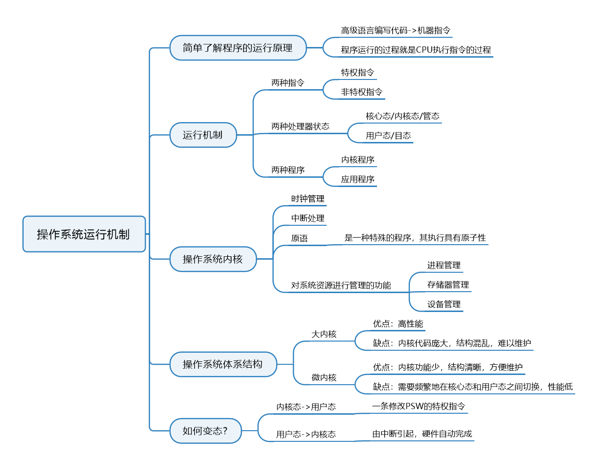

# 计算机系统概述

## 操作系统概念、功能

## 操作系统的四个特征

## 操作系统发展与分类

## 操作系统运行机制

CPU中有一个寄存器叫`程序状态字寄存器(PSW)`，其中有个二进制位，1表示"内核态"，0表示"用户态"

内核态=核心态=管态，用户态=目态

## 中断和异常

"中断"是操作系统夺回CPU控制权地唯一途径。

## 系统调用

## 操作系统体系结构

### 大内核与微内核

### 分层结构、模块化、外核

## 操作系统引导

## 虚拟机

