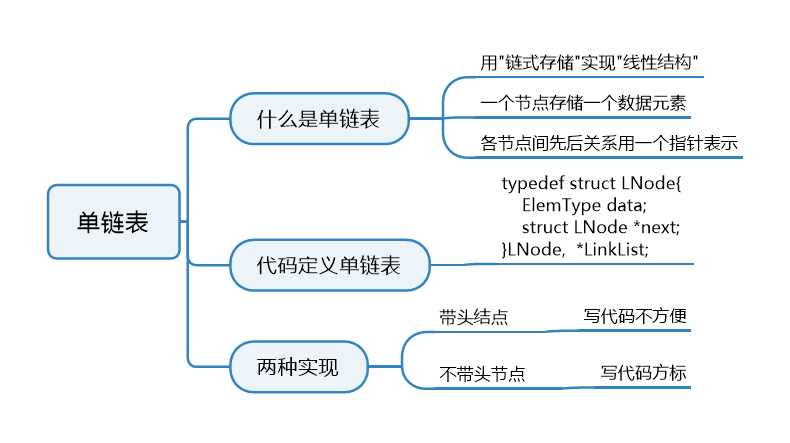

# 绪论

·算法`时间复杂度`：`时间开销`与`问题规模`之间的关系

# 线性表


```C++
// 基本操作
InitList(&L)
DestroyList(&L)
    
ListInsert(&L, i, e)
ListDelete(&L, i, &e)
    
LocateElem(L, e)
GetElem(L, i)
    
// 其他常用操作
Length(L)
PrintList(L)
Empty(L)
```

注意事项：

- `&`：引用符号，如果要使用的操作影响到原来的状态，就要加上。

## 顺序表定义


### 静态分配

`逻辑上`相邻的元素在`物理位置`上也相邻。

```C++
// 顺序表实现-静态分配
#define MaxSize 10
typedef struct{
    ElemType data[MaxSize];
    int length;
}SqList;
```

```C++
#include <stdio.h>
#define MaxSize 10
typedef struct{
    int data[MaxSize];
    int length;
}SqList;

// 初始化一个顺序表
void InitList(SqList &L)
{
    for (int i = 0; i < MaxSize; i ++ )
        L.data[i] = 0;
    L.length = 0;
}

int main()
{
    SqList L;
    InitList(L);
    // ...
    return 0;
}
```

存在的问题：一旦申请之后，数组长度无法修改。

### 动态分配

```C++
#define InitSize 10
typedef struct{
    ElemType *data; // 指示动态分配数组的指针
    int MaxSize;
    int length;
}SeqList;
```

```C++
#include <stdio.h>
#define InitSize 10

typedef struct{
	int *data;
	int MaxSize;
	int length;
}SeqList; 

void InitList(SeqList &L)
{
	L.data = (int *)malloc(InitSize * sizeof(int));
	L.length = 0;
	L.MaxSize = InitSize;
}

void IncreaseSize(SeqList &L, int len)
{
	int *p = L.data; // 开一个临时地址，指向L的起始位置
	L.data = (int *)malloc((L.MaxSize+len) * sizeof(int)); // 开一片新的连续空间
	for (int i = 0; i < L.length; i ++ )
		L.data[i] = p[i];
	L.MaxSize = L.MaxSize + len;
	free(p);
}

int main(int argc, char** argv) {
	SeqList L;
	InitList(L);
	
	IncreaseSize(L, 5);
	return 0;
}
```

### 顺序表的特点

1. 随机访问：可以在O(1)的时间内找到第i个元素
2. 存储密度高，每个节点只存储数据元素
3. 拓展容量不方便
4. 插入、删除元素不方便，需要移动大量元素

## 顺序表插入删除


### 插入

```C++
#include <stdio.h>
#define MaxSize 10

typedef struct{
	int data[MaxSize];
	int length;
}SqList;

void InitList(SqList &L)
{
	for (int i = 0; i < L.length; i ++ )
		L.data[i] = 0;
	L.length = 0;
}
/* base logic code 
void ListInsert(SqList &L, int i, int e)
{
	for (int j = L.length; j >= i; j --)
		L.data[j] = L.data[j-1];
	L.data[i-1] = e;
	L.length ++ ;
}
*/

// strong code
bool ListInsert(SqList &L, int i, int e)
{
	if (i < 1 || i > L.length + 1) // wrong locate
		return false;
	if (L.length >= MaxSize) // judge overflow 
		return false;
	for (int j = L.length; j >= i; j -- )
		L.data[j] = L.data[j-1];
	L.data[i-1] = e;
	L.length ++ ;
	return true;	
}

int main(int argc, char** argv) {
	SqList L;
	InitList(L);

	ListInsert(L, 1, 2);
	ListInsert(L, 2, 3);
	ListInsert(L, 3, 999);
	
	
	for (int i = 0; i < L.length; i ++ )
		printf("%d ", L.data[i]);
	return 0;
}
```

时间复杂度分析：

1. 最好：O(1)
2. 最坏：O(n)
3. 平均：O(n)，每个插入位置的概率为$\frac{1}{1+n}$

### 删除

```C++
#include <stdio.h>
#define MaxSize 10

typedef struct{
	int data[MaxSize];
	int length;
}SqList;

void InitList(SqList &L)
{
	for (int i = 0; i < L.length; i ++)
		L.data[i] = 0;
	L.length = 0;
}

bool ListInsert(SqList &L, int i, int e)
{
	if (i < 1 || i > L.length + 1)
		return false;
	if (L.length >= MaxSize)
		return false;
	for (int j = L.length; j >= i; j -- )
		L.data[j] = L.data[j-1];
	L.data[i-1] = e;
	L.length ++;
	return true;	
}

bool ListDelete(SqList &L, int i, int &e)
{
	if (i < 1 || i > L.length)
		return false;
	e = L.data[i-1];
	for (int j = i; j < L.length; j ++)
		L.data[j-1] = L.data[j];
	L.length --;
	return true;
}

void ListPrint(SqList L)
{
	for (int i = 0; i < L.length; i ++ )
		printf("%d ",L.data[i]);
	printf("\n");
}

int main(int argc, char** argv) {
	SqList L;
	InitList(L);
	
	// Insert some test data
	ListInsert(L, 1, 1);
	ListInsert(L, 2, 2);
	ListInsert(L, 3, 3);
	ListInsert(L, 4, 4);
	
	ListPrint(L);
	
	// delete
	int e = -1;
	ListDelete(L, 3, e);

	ListPrint(L);
	return 0;
}
```

时间复杂度：

1. 最好：O(1)
2. 最坏：O(n)
3. 平均：O(n)，每个删除位置的概率为$\frac{1}{n}$

## 顺序表查找


```C++
#include <stdio.h>
#include <stdlib.h>
#define InitSize 10

typedef struct{
	int *data;
	int MaxSize;
	int length;
}SqList;

void InitList(SqList &L)
{
	L.data = (int *)malloc(InitSize * sizeof(int));
	L.length = 0;
	L.MaxSize = InitSize;
}

// Insert
bool ListInsert(SqList &L, int i, int e)
{
	if (i < 1 || i > L.length + 1)
	 	return false;
	if (L.length >= InitSize)
		return false; 
	for (int j = L.length; j >= i; j -- )
		L.data[j-1] = L.data[j];
	L.data[i-1] = e;
	L.length ++ ;
	return true;
}

// find by locate
int GetElem(SqList L, int i)
{
	return L.data[i-1];
}

// find by value
int LocateElem(SqList L, int e)
{
	for (int i = 0; i < L.length; i ++ )
		if (L.data[i] == e)
			return i+1;
	return 0;
}

void PrintList(SqList L)
{
	for (int i = 0; i < L.length; i ++ )
		printf("%d ", L.data[i]);
	printf("\n"); 
	return;
}

int main(int argc, char** argv) {
	SqList L;
	InitList(L);
	
	// insert some value
	ListInsert(L, 1, 1);
	ListInsert(L, 2, 2);
	ListInsert(L, 3, 3);
	ListInsert(L, 4, 66);
	
	PrintList(L);
	
	//  按位查找结果 
	printf("%d\n", GetElem(L, 2));
	
	//  按值查找结果 
	printf("%d", LocateElem(L, 66));
	return 0;
}
```

## 单链表定义



### 不带头结点

```C++
#include <stdio.h>

typedef struct LNode{
	ElemType data;
	struct LNode *next;
}LNode, *LinkList;

bool InitList(LinkList &L)
{
	L = NULL;
	return true;
}

bool Empty(LinkList L)
{
	if (L == NULL)
		return true;
	else 
		return false;
}

int main(int argc, char** argv) {
	LinkList L;
	
	InitList(L);
	return 0;
}
```

### 带头结点

```C++
#include <stdio.h>

typedef struct LNode{
	ElemType data;
	struct LNode *next; 
}LNode, *LinkList; 

bool InitList(LinkList &L)
{
	L = (LNode *)malloc(sizeof(LNode));
	if (L == NULL)
		return false;
	L->next = NULL;
	return true;
}

bool Empty(LinkList L)
{
	if (L->next == NULL)
		return true;
	else 
		return false;
}

int main(int argc, char** argv) {
	LinkList L;
	InitList(L);
	return 0;
}
```

## 单链表插入删除


### 按位序插入(带头)

在第i个位置上插入元素e

```C++
typedef struct LNode
{
	ElemType data;
    struct LNode *next;
}LNode, *LinkList;

bool ListInsert(LinkList &L, int i, ElemType e)
{
    if (i < 1) return false;
    LNode *p;
    int j = 0;
    p = L;
    while (p != NULL && j < i - 1)
    {
        p = p->next;
        j ++ ;
    }
    if (p == NULL) return false;
    LNode *s = (LNode *)malloc(sizeof(LNode));
    s->data = e;
    s->next = p->next;
    p->next = s;
    return true;
}
```

分析(若表长为5)：

1. i=1，插在表头
2. i=3，插在表中
3. i=5，插在表尾
4. i=6，i>Length

### 按位序插入(不带头)

```C++
bool ListInsert(LinkList &L, int i, ElemType e)
{
	if (i < 1) return false;
    if (i == 1)
    {
        LNode *s = (LNode *)malloc(sizeof(LNode));
        s->data = e;
        s->next = L;
        L =s;
        return true;
    }
    LNode *p;
    int j = 1;
    p = L;
    while (p != NULL && j < i - 1)
    {
        p = p->next;
        j ++ ;
    }
    if (p == NULL) return false;
    LNode *s = (LNode *)malloc(sizeof(LNode));
    s->data = e;
    s->next = p->next;
    p->next = s;
    return true;
}
```

### 后插、前插

```C++
// 后插操作：在p节点之后插入元素e
bool InsertNextNode(LNode *p, ElemType e)
{
	if (p == NULL) return false;
    LNode *s = (LNode *)malloc(sizeof(LNode));
    if (s == NULL) return false; // 内存分配失败
    s->data = e;
    s->next = p->next;
    p->next = s;
    return true;
}

// 前插操作：在p节点之前插入元素e
bool InsertPriorNode(LNode *p, ElemType e)
{
	if (p == NULL) return false;
    LNode *s = (LNode *)malloc(sizeof(LNode));
    if (s == NULL) return false;
    s->next = p->next;
    p->next = s;
    s->data = p->data;
    p->data = e;
    return true;
}
```

### 按位序删除

```c++
bool ListDelete(LinkList L, int i, ElemType &e)
{
	if (i < 1) return false;
	LNode *p;
	int j = 0;
	p = L;
	while (p != NULL && j < i - 1)
	{
		p = p->next;
		j ++ ;
	}
	if (p == NULL) return false;
	if (p->next = NULL) return false;
	LNode *q = p->next;
	e = q->data;
	p->next = q->next;
	free(q);
	return true; 
}
```

### 指定节点的删除

```C++
bool DeleteNode(LNode *p)
{
    if (p == NULL) return false;
    LNode *q = p->next;
    p->data = p->next->data;
    p->next = q->next;
    free(p);
    return true;
}
```

## 单链表查找


### 按位查找

```C++
LNode* GetElem(LinkList, int i)
{
    if (i < 0) return NULL;
    LNode *p;
    int j = 0;
    p = L;
    while (p != NULL && j < i)
    {
		p = p->next;
        j ++ ;
    }
    return p;
}
```

### 按值查找

```C++
LNode* LocateElem(LinkList L, ElemType e)
{
	LNode *p = L->next;
    while (p != NULL && p->data != e)
        p = p->next;
    return p;
}
```

### 求表长

```C++
// 同样的思想
int Length(LinkList L)
{
	LNode *p = L;
    int len = 0;
    while (p->next != NULL)
    {
        p = p->next;
        len ++ ;
	}
    return len;
}
```

## 单链表的建立

### 尾插法

```C++
#include <stdio.h>
#include <stdlib.h>

typedef struct LNode
{
	int data;
	struct LNode *next;
}LNode, *LinkList;

LinkList ListRailInsert(LinkList &L)
{
	int x;
	L = (LinkList)malloc(sizeof(LNode));
	LNode *s, *r = L;
	scanf("%d", &x);
	while (x != 999)
	{
		s = (LNode *)malloc(sizeof(LNode));
		s->data = x;
		r->next = s;
		r = s;
		scanf("%d", &x);
	}	
	r->next = NULL;
	return L;
} 

bool PrintList(LinkList L)
{
	LNode *p = L->next;
	while (p != NULL)
	{
		printf("%d ", p->data);
		p = p->next;
	}
	return true; 
}

int main()
{
	LinkList L;
	ListRailInsert(L);
	PrintList(L);
}
```

### 头插法

```C++
#include <stdio.h>
#include <stdlib.h>

typedef int ElemType;

typedef struct LNode
{
	ElemType data;
	struct LNode *next;
}LNode, *LinkList;

LinkList ListFrontFound(LinkList &L)
{
	L = (LinkList)malloc(sizeof(LNode));
	L->next = NULL;
	int x;
	scanf("%d", &x);
	while (x != 999)
	{
		LNode *s = (LNode *)malloc(sizeof(LNode));
		s->data = x;
		s->next = L->next;
		L->next = s;
		scanf("%d", &x);	
	} 
	return L;
}

bool PrintList(LinkList L)
{
	LNode *p = L->next;
	while (p != NULL)
	{
		printf("%d ", p->data);
		p = p->next;
	}
	return true;
}

int main(int argc, char** argv) {
	LinkList L;
	ListFrontFound(L);
	PrintList(L); 
	
	return 0;
}
```

## 双链表

```C++
#include <stdio.h>
#include <stdlib.h>

typedef struct DNode
{
	int data;
	struct DNode *prior, *next;
}DNode, *DLinkList;

// 初始化 
bool InitDLinkList(DLinkList &L)
{
	L = (DNode *)malloc(sizeof(DNode));
	if (L == NULL)
		return false;
	L->prior = NULL;
	L->next = NULL;
	return true;
}

// 判空 
bool Empty(DLinkList L)
{
	return (L->next = NULL);
}

// 插入:将节点*s插入到*p之后 
bool InsertNextDNode(DNode *p, DNode *s) 
{
	if (p == NULL || s == NULL) return false;
	s->next = p->next;
	if (p->next != NULL)
		p->next->prior = s;
	p->next = s;
	s->prior = p; 
	return true;
}

// 删除p后继节点
bool DeleteNextDNode(DNode *p)
{
	if (p == NULL) return false;
	DNode *q = p->next;
	if (q == NULL) return false;
	p->next = q->next;
	if (q->next != NULL)
		q->next->prior = p;
	free(p);
	return true;	
} 

// 遍历 
while(p != NULL)
{
	p = p->next; // 后向 
	p = p->prior;	// 前向 
} 

// 跳过头节点
while (p->prior != NULL)
{
	p = p->prior;	
} 

int main(int argc, char** argv) {
	return 0;
}
```

## 循环链表


### 循环单链表

```C++
typedef struct LNode
{
    ElemType data;
    struct LNode *next;
}LNode, *LinkList;

// 初始化
bool InitList(LinkList &L)
{
    L = (LinkList)malloc(sizeof(LNode));
    if (L == NULL) return false;
    L->next = L;
    return true;
}

// 判空
bool Empty(LinkList L)
{
    if (L->next == L) return true;
    else return false;
}

// 判断节点p是否是循环链表的尾节点
bool IsTail(L)
{
    if (p->next == L) return true;
    else return false;
}
```

### 循环双链表

```C++
typedef struct DNode
{
    ElemType data;
    struct DNode *prior, *next;
}DNode, *DLinkList;

bool InitDLinkList(DLinkList &L)
{
    L = (DLinkList)malloc(sizeof(DNode));
    if (L == NULL) return false;
    L->next = L;
    L->prior = L;
    return true;
}

bool Empty(DLinkList L)
{
    return (L->next == NULL);
}

// 判断节点p是否是表尾节点
bool IsTail(DLinkList L, DNode *p)
{
    return (p->next == L);
}
```

## 静态链表

```C++
#define MaxSize 10
struct Node
{
	ElemType data;
    int next;
}SLinkList[MaxSize];

void testSLinkList()
{
    struct Node a[MaxSize];
}
```


