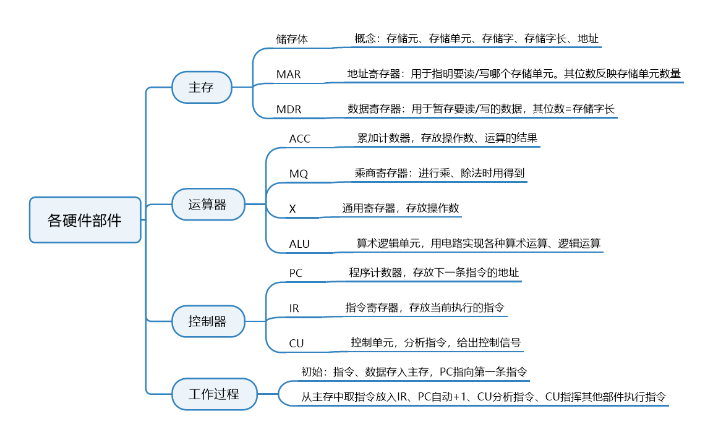

# 计算机系统概述

考纲内容：

## 计算机硬件基本组成

硬件系统和软件系统共同构成一个完整的计算机系统。

某一功能既可以硬件实现，又可以软件实现。软硬件在逻辑功能上是等价的。

### 早期冯诺依曼机

### 现代计算机

## 各个硬件的工作原理

### 主存储器

- Memory Address Register:存储地址寄存器
- Memory Data Register:存储数据寄存器

### 运算器

### 控制器

### 计算机工作过程

## 计算机系统的多层次结构

## 存储器性能指标

`总容量`=存储单元个数×存储字长(1Byte = 8bit)

MAR位数反映存储单元个数

MDR位数=存储字长=每个存储单元大小

$2^{10}:K$

$2^{20}:M$

$2^{30}:G$

$2^{40}:T$

